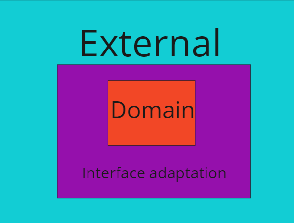

# ARCHITECTURE

## 1 Camadas



### 1.1 Camada de regra de negócio (Domain)

Responsável por representar e executar o que o sistema deve fazer, ou seja, as regras de negócio.
Essa camada DEVE ser a mais pura possível.
Essa camada não DEVE se conectar diretamente a uma camada externa, e sim por meio da camada de adaptação de interface (vide: 1.2).
Essa camada deve validar os dados.

### 1.1.1 Designs do domain

**Entities**: Representar a regra de negócio.[Documentation](https://www.codeproject.com/Articles/4293/The-Entity-Design-Pattern).
A classe que representa uma entidade não deve conter execuções de lógica ou factories como **fromJson** e **toJson**.
Toda entidade deve herdar de Equatable para facilitar a compreensão das instâncias perante uma situação de comparação.
Toda entidade deve ser imutável.

```dart
class UserEntity extends Equatable {
    final int id;
    final String name;
    final String email;

    const UserEntity(this.id, this.name, this.email);

    UserEntity copyWith({
        int? id,
        String? name,
        String? email,
    }){
        return UserEntity(
            id ?? this.id,
            name ?? this.name,
            email ?? this.email,
        );
    }

    List get props => [id, name, email];
}
```

**ValueObject**: Auxiliar na validação dos dados. [Documentation](https://medium.com/@lexitrainerph/deep-dive-into-the-value-object-pattern-in-c-basics-to-advanced-b058b49d8565#:~:text=Introduction,which%20have%20a%20distinct%20identity.).

Deve ser uma instância imutável.
O uso de **ValueObject** pode ser feito para validação de formulários mas não se limitando a ser.

```dart
class Email {
    final String value;

    Email(this.value);

    String? validate(){
        if(value.isEmpty){
            return 'Email can\'t be empty';
        }
    }
}
```

**Usecase**: Responsável por executar as regras de negócio. [Documentation](https://martinfowler.com/bliki/UseCase.html).

Um usecase não deve chamar outro usecase. Este também não deve fazer acesso direto a componentes externos, necessitando o uso de algum design ou instrução da camada de adaptação.
UseCases devem ter uma interface e uma implementação separadas.
O método call deve conter apenas um argumento. Se houver a necessidade de mais argumentos, favor usar DTO.

```dart
abstract class FetchFoods {
   Future<List<FoodEntity>> call();
}

class FetchFoodsWithFoodRepository implements FetchFoods {
    Future<List<FoodEntity>> call(FetchFoodDTO dto){
        return [];
    }
}
```

**Data Transfer Object**: Deve ser usado para mitigar o uso de mais de um argumento nas execuções de regras.

```dart
class FetchFoodDTO {
    final int page;
    final int offset;
    final String? query;

    FetchFoodDTO(this.page, this.offset, this.query);
}
```

### 1.2 Camada de adaptação (Interface Adaptation)

Essa camada serve pra ligar o domain com os componentes externos.
Essa camada será responsável por agir como intermediador, transformando e adaptando os dados.

### 1.1.1 Design da adaptação

**Princípio inversão de controle**: Esse principio é necessário para força o desenvolvedor a utilizar interfaces ou classes abstratas em vez de usar diretamente a implementação

**Injeção dependência**: Automatizar a inversão de controle.

**Adapter**: Lida com as conversões de dados [Conversão de dados](https://refactoring.guru/design-patterns/adapter).

```dart
class UserAdapter {
    const UserAdapter._();

    static UserEntity fromJson(dynamic json){
        ...
    }

    static Map<String, dynamic> toJson(UserEntity entity){
        ...
    }

}

```

### 1.3 Camada de componentes externos (Frameworks and Drivers)

Deve fornecer interação com o usuário e comunicações com drivers externos como consumo de API ou banco de dados.

### 1.1.1 Packages

- **Base de dados local**: SQflite.
- **Hashcode e operadores de igualdade**: Equatable.
- **Sistema de injeção de dependências**: auto_injector.

## 2. Estrutura de pasta

```dart
.
└── lib/
    ├── app/
    │   ├── core/
    │   │   └── services/
    │   │       └── validator_service.dart
    │   └── features/
    │       └── auth/
    │           ├── data/
    │           │   ├── adapters/
    │           │   │   └── user_adapter.dart
    │           │   ├── datasources/
    │           │   │   └── remote_datasouce.dart
    │           │   └── repositories/
    │           │       └── auth_repository.dart
    │           ├── presenter/
    │           │   ├── widgets/
    │           │   │   └── password_field.dart
    │           │   ├── pages/
    │           │   │   └── auth_page.dart
    │           │   └── stores/
    │           │       └── auth_store.dart
    │           ├── domain/
    │           │   ├── entities/
    │           │   │   └── user_entity.dart
    │           │   ├── usecases/
    │           │   │   ├── change_password_usecase.dart
    │           │   │   ├── login_usecase.dart
    │           │   │   └── logout_usecase.dart
    │           │   ├── repositories/
    │           │   │   └── auth_repository.dart
    │           │   ├── dtos/
    │           │   │   └── credentials_dto.dart
    │           │   └── vos/
    │           │       ├── email_vo.dart
    │           │       └── username_vo.dart
    │           └── auth_module.dart
    └── main.dart
```

## 2.2 Pasta Core

Aqui ficará todos componentes comuns a todas as features.

## 2.3 Pasta Feature

Essa pasta representará as camadas das features.

### 2.3.1 Domain

Responsável por guardar os usecases e entidades da aplicação.

### 2.3.2 Data

Responsável por implementar os componentes externos a regra de de negócio.

### 2.3.3 Presenter

Responsável pela representação visual do app

## 2.4 Nomeclatura de arquivos

Todos os arquivos devem finalizar com _nome_do_design_pattern, como por exemplo:

```dart
product_repository.dart

//entity
user_entity.dart

```

Arquivos não nomeados dessa forma serão considerados errados.
